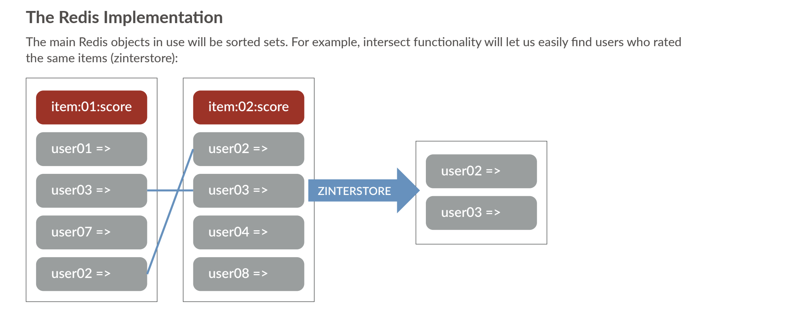

# Recommendation Engine

## Overview
A Simple Colleabartive filtering recommendation engine written in [Go](https://golang.org/) using [Redis](http://redis.io) as the In memory persistence store. The collabrative filtering algortithm was heavilly borrowed from




## Swagger doc
Swagger documentation can be accessed here: `http://localhost:3000/swagger/index.html`

## Usage

1.  Run redis locally: `docker run -p 6379:6379 --network redis-network --name some-redis -d redis`

2. Install [httpie](https://httpie.io/) or simply use curl

3. See samples below for all the API calls

```
======== CREATING SOME RATINGS ==========

 👉  http post localhost:3000/api/rate user=user2 item=item1 score:=5.6
HTTP/1.1 201 Created
Content-Length: 43
Content-Type: application/json
Date: Tue, 02 Mar 2021 08:44:49 GMT

{
    "Item": "item1",
    "Score": 5.6,
    "user": "user2"
}


 👉  http post localhost:3000/api/rate user=user2 item=item2 score:=5.6
HTTP/1.1 201 Created
Content-Length: 43
Content-Type: application/json
Date: Tue, 02 Mar 2021 08:44:59 GMT

{
    "Item": "item2",
    "Score": 5.6,
    "user": "user2"
}


👉  http post localhost:3000/api/rate user=user2 item=item3 score:=5.6
HTTP/1.1 201 Created
Content-Length: 43
Content-Type: application/json
Date: Tue, 02 Mar 2021 08:45:03 GMT

{
    "Item": "item3",
    "Score": 5.6,
    "user": "user2"
}


👉  http post localhost:3000/api/rate user=user2 item=item4 score:=8.6
^[[DHTTP/1.1 201 Created
Content-Length: 43
Content-Type: application/json
Date: Tue, 02 Mar 2021 08:45:10 GMT

{
    "Item": "item4",
    "Score": 8.6,
    "user": "user2"
}


👉  http post localhost:3000/api/rate user=user1 item=item1 score:=5.6
HTTP/1.1 201 Created
Content-Length: 43
Content-Type: application/json
Date: Tue, 02 Mar 2021 08:45:21 GMT

{
    "Item": "item1",
    "Score": 5.6,
    "user": "user1"
}

====== QUERYING SUGGESTIONS FOR A GIVEN USER =========

👉  http get localhost:3000/api/suggestion/user1                      
HTTP/1.1 200 OK
Content-Length: 88
Content-Type: application/json
Date: Tue, 02 Mar 2021 08:45:31 GMT

[
    {
        "item": "item4",
        "score": 8.6
    },
    {
        "item": "item3",
        "score": 5.6
    },
    {
        "item": "item2",
        "score": 5.6
    }
]

=========  Getting probability for a given user with an item ==========

 👉  http get localhost:3000/api/probability/user1/item2
HTTP/1.1 200 OK
Content-Length: 49
Content-Type: application/json
Date: Tue, 02 Mar 2021 08:49:12 GMT

{
    "item": "item2",
    "propability": 5.6,
    "user": "user1"
}

===== Get all the popular items ==============

👉  http get 34.89.236.249:9000/api/items
HTTP/1.1 200 OK
Content-Length: 58
Content-Type: application/json
Date: Mon, 08 Mar 2021 19:13:57 GMT

{
    "data": [
        {
            "item": "A3",
            "score": 2
        },
        {
            "item": "A2",
            "score": 1
        }
    ]
}

== Get all the items that the user rated / bought =======

👉  http get localhost:3000/api/items/user/A                  
HTTP/1.1 200 OK
Content-Length: 45
Content-Type: application/json
Date: Mon, 08 Mar 2021 19:19:02 GMT

{
    "data": [
        {
            "item": "A3",
            "score": 0
        }
    ],
    "user": "A"
}